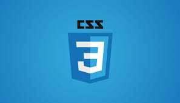

##  Tadeu Henrique

•	Desenvolvedor Front-End

•	Estudante plataforma  <a href = ‘https://cursos.dankicode.com/’> Danki Code</a>

•	Tecnologias que estudo:

<code></code>&nbsp;
<code></code>&nbsp;
<code></code>&nbsp;

